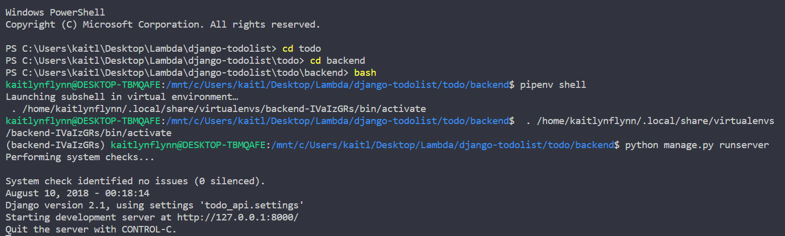
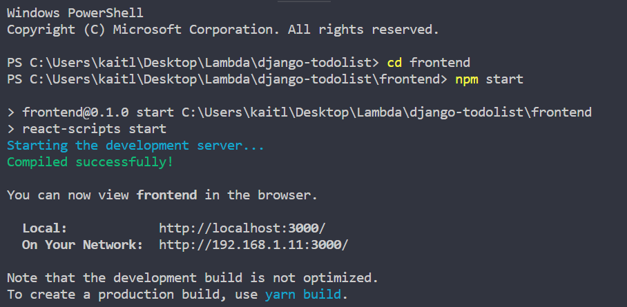

# django-todolist
To Do List app created with django and React! 

Directions to view: 
1. Open terminal and cd into `todo` 
2. cd into `backend`    
3. run bash
4. run `pipenv shell` 
5. run `python manage.py runserver`

## Open a 2nd terminal
1. cd into `frontend`
2. run `npm start`
3. Browser should open automatically to localhost:3000 and display 3 notes!

